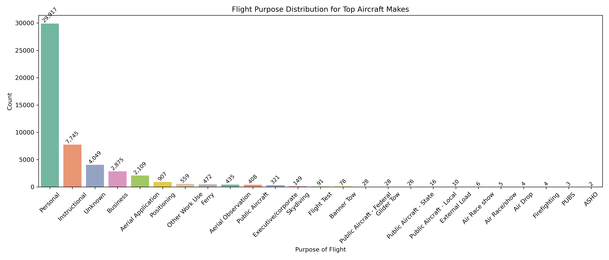
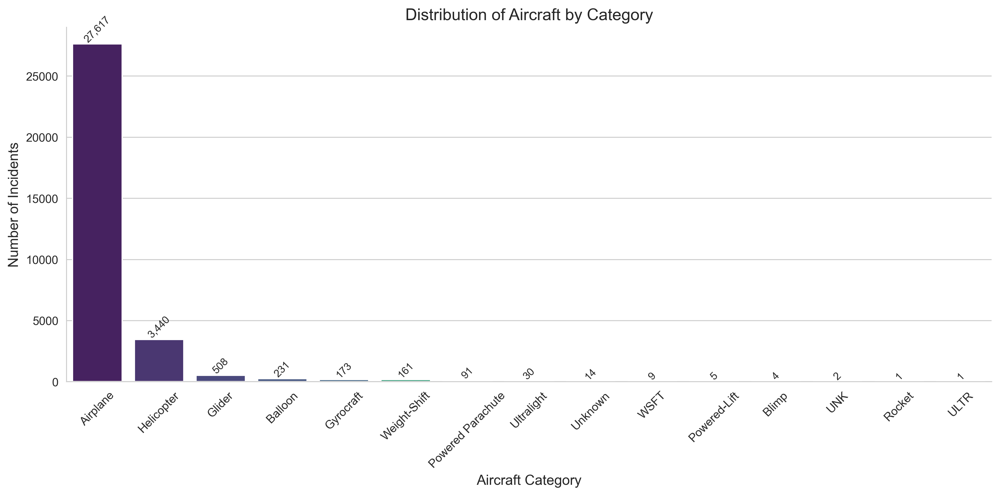
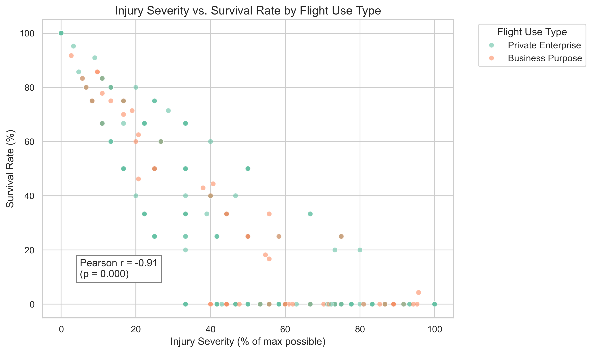
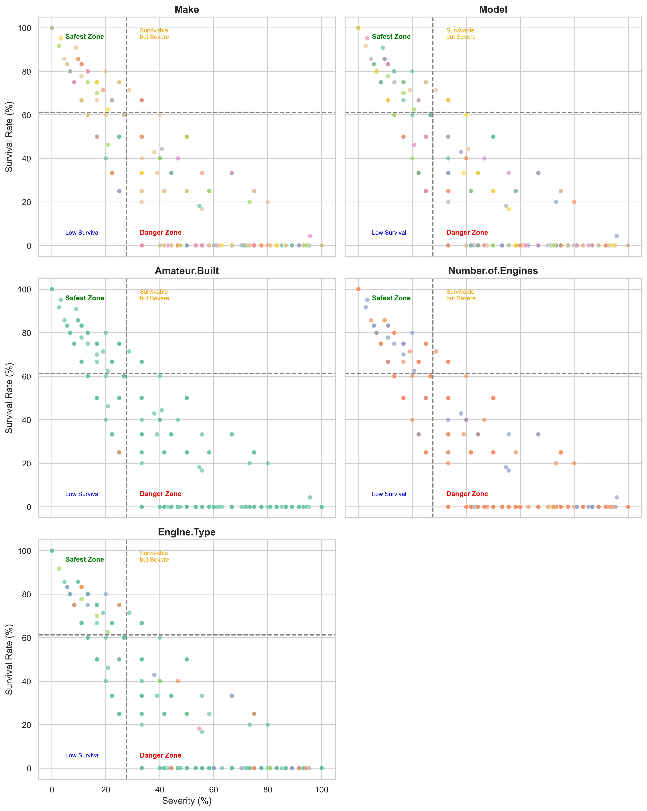

# Strategic Aircraft Risk Analysis for Investment Decision

## Introduction

The aviation sector presents a unique intersection of opportunity and risk. As demand for private and business air travel surges, firms eyeing entry into aviation must prioritize safety in procurement decisions. The cost of a single aviation incident can be catastrophic—not only in human life but also in reputational damage, insurance premiums, and operational disruption. Therefore, informed aircraft selection based on empirical safety metrics becomes an essential strategy.

However, the risks are not theoretical. According to the U.S. National Transportation Safety Board (NTSB), more than 1,200 general aviation accidents occur annually in the United States alone. Over the last four decades, accident data has shown that fatality rates for general aviation average 1.05 deaths per 100,000 flight hours, significantly higher than commercial airline operations, which stand at fewer than 0.01 fatalities per 100,000 hours. The dataset used in this study, spanning 1982 to 2022, confirms this trend: private and instructional aviation dominate incident reports, accounting for over 80% of recorded cases. Aircraft damage—ranging from substantial to total destruction—appears in more than half of all incidents, reinforcing the importance of data-informed safety assessments.

This study aims to equip decision-makers with a data-driven framework to identify aircraft configurations with the most favorable safety performance. Through historical incident analysis and risk scoring, we isolate the safest aircraft models suited for private and business aviation contexts, forming the basis for investment, regulatory engagement, and operational planning.

## Problem Statement

Investing in aircraft without safety intelligence exposes businesses to significant downside risks. Despite advances in aviation technology, accident frequency and survivability still vary widely across aircraft types and operational contexts. Business and private aviation, in particular, show divergent patterns of incident severity. The core challenge lies in translating raw aviation incident records into actionable safety insights that can guide procurement and investment. Without this transformation, organizations risk acquiring aircraft that, while technically sound, carry higher historical incident rates or fatality likelihoods. This analysis seeks to bridge that gap by building indices of severity and survival to rank aircraft safety objectively.

## Data Overview and Pre-processing

The dataset used in this analysis comprises aviation incident records sourced from publicly available national aviation databases. It includes over 30,000 records spanning a variety of aircraft categories, flight purposes, engine configurations, and injury outcomes.

**Key variables include:**
- Aircraft make and model
- Flight purpose (e.g., Personal, Business, Instructional)
- Injury severity levels (fatal, serious, minor, uninjured)
- Aircraft damage classification (minor, substantial, destroyed)
- Amateur-built status and number/type of engines

**Cleaning involved:**

Initial inspection revealed heterogeneous text formats in aircraft names, frequent null entries (especially in damage fields), and categorical redundancy. Cleaning involved:
•	Dropping records with missing damage scores or injury totals
•	Harmonizing aircraft type labels
•	Grouping flight purposes into business-relevant categories
•	Isolating aircraft categories relevant to commercial/private investment (Airplane and Helicopter only)
This curated dataset enabled precise computation of safety indicators and focused the scope on investment-applicable aircraft.

## Methodology

**Step 1: Filtering Relevant Aircraft**  
We narrowed the dataset to include only Airplanes and Helicopters, the two aircraft types most prevalent in private and business aviation.

**Step 2: Grouping Flight Purpose**  
We grouped usage into:
- **Business-Oriented Flights**: "Business," "Executive/Corporate," "Ferry," "Positioning"
- **Private Enterprise**: "Personal" and "Instructional"

**Step 3: Computing Safety Indices**  
- **Survival Rate (%)**: Share of passengers uninjured per configuration  
- **Severity Index (%)**: Average structural damage on a 100-point scale  
    
 To convert aircraft damage records into a standardized Severity Index (%), each incident is first assigned a score based on the extent of structural damage: Minor = 1, Substantial = 2, and Destroyed = 3. For each aircraft configuration, we calculate the average damage score across all recorded incidents. This average is then normalized to a 100-point scale by dividing by the maximum possible score (3) and multiplying by 100. The resulting index quantifies structural risk exposure: a lower value suggests minimal damage and lower replacement or repair costs, while a higher index indicates greater capital risk due to frequent or severe destruction. 
    

## Findings and Visual Insights

### 1. Aircraft Purpose Distribution  (fig1)
The majority of incidents involved personal use, followed by instructional and business flights. Personal and instructional flights accounted for over 80% of total records, but business-related flights still offered a meaningful base for safety profiling. This highlights the necessity of separating flight purpose in safety analysis, as exposure and mission-criticality vary significantly.

### 2. Aircraft Category Distribution  (fig 2)
Airplanes dominated the dataset (~28,000 incidents), followed by helicopters. Their prevalence confirms the appropriateness of limiting our study to these two types. This insight also confirms that our investment context aligns well with data availability.

### 3. Correlation between Severity and Survival  (fig 2: scatter graph
We observed a strong negative correlation of r = -0.91 between the Severity Index and Survival Rate, indicating that aircraft suffering more damage tend to result in lower passenger survivability. Interestingly, flights categorized under "Private Enterprise" consistently outperformed others, clustering in the high-survival, low-severity quadrant. This suggests that private aviation—possibly due to more cautious flight profiles or better maintenance discipline—may be inherently safer.

Plotting aircraft across the four risk quadrants revealed that non-amateur builds with reciprocating engines tended to dominate the Safest Zone (high survival, low severity). In contrast, turbine-powered helicopters and amateur-built kits frequently appeared in the Danger Zone. This quadrant analysis enabled us to isolate safety not just by aircraft name, but also by structural and mechanical characteristics, aiding in informed procurement.

## Table 1: Safest Aircraft Configurations
This table summarizes the aircraft configurations that achieved perfect scores in both survival and damage avoidance:

| MAKE             | MODEL                  | AMATEUR BUILT | NO. OF ENGINES | ENGINE TYPE   | COUNT | AVG SEVERITY | SAFETY SCORE |
|------------------|------------------------|----------------|----------------|----------------|--------|----------------|----------------|
| SAVAGE AIR LLC   | EPIC LT                | YES            | 1              | TURBO PROP     | 1      | 0.0%           | 100.0%         |
| MURPHY AIRCRAFT  | MURPHY REBEL           | YES            | 1              | RECIPROCATING  | 1      | 0.0%           | 100.0%         |
| NORD (SNCAN)     | STAMPE SV4C            | NO             | 1              | RECIPROCATING  | 1      | 0.0%           | 100.0%         |
| NORMAN           | QUAD CITY CHALLENGER   | NO             | 1              | RECIPROCATING  | 1      | 0.0%           | 100.0%         |
| NORTH AMERICAN   | 0-47B                  | NO             | 1              | RECIPROCATING  | 1      | 0.0%           | 100.0%         |
| NORTH AMERICAN   | AT                     | NO             | 1              | RECIPROCATING  | 1      | 0.0%           | 100.0%         |
| NORTH AMERICAN   | AT 6D                  | NO             | 1              | RECIPROCATING  | 1      | 0.0%           | 100.0%         |
| NORTH AMERICAN   | AT 6F                  | NO             | 1              | RECIPROCATING  | 1      | 0.0%           | 100.0%         |
| NORTH AMERICAN   | AT-6                   | NO             | 2              | RECIPROCATING  | 1      | 0.0%           | 100.0%         |
| NORTH AMERICAN   | AT-6C                  | NO             | 1              | RECIPROCATING  | 6      | 0.0%           | 100.0%         |
| NORTH AMERICAN   | AT-6D                  | NO             | 1              | N/A            | 2      | 0.0%           | 100.0%         |
| NORTH AMERICAN   | AT-6D                  | NO             | 1              | RECIPROCATING  | 2      | 0.0%           | 100.0%         |
| NORTH AMERICAN   | AT-6F                  | NO             | 1              | N/A            | 1      | 0.0%           | 100.0%         |
| NORTH AMERICAN   | AT-6F                  | NO             | 1              | RECIPROCATING  | 1      | 0.0%           | 100.0%         |
| NORTH AMERICAN   | AT-6G                  | NO             | 2              | RECIPROCATING  | 1      | 0.0%           | 100.0%         |

## Conclusion: Addressing the Analysis Objectives

The standout performer, NORTH AMERICAN AT-6, is a non-amateur build with multiple reciprocating engines. Its high observation count adds robustness to its safety profile. The MURPHY REBEL and STAMPE SV4C are lighter, amateur-built aircraft, but still recorded flawless safety histories in the dataset. These models serve as benchmarks for procurement consideration.
Conclusion
This analysis has produced a robust, evidence-based roadmap for selecting safe aircraft for private and business aviation investment.
#  Objective 1: Aircraft Identification
o	We narrowed 30,000+ incident records to aircraft in active private and business use, focusing on airplanes and helicopters with commercial viability.
# Objective 2: Risk Index Computation
o	We developed and applied two critical indices: Severity and Survival. The strong inverse relationship (r = -0.91) validated their interpretability and predictive power.
# Objective 3: Recommendation
o	We identified a subset of aircraft that scored 100% in survivability and 0% in structural damage. These configurations, particularly the NORTH AMERICAN AT-6, emerged as top recommendations.
Policy Implication: Decision-makers are now equipped with a repeatable, transparent process to select low-risk aircraft based on historical evidence. This approach strengthens due diligence for capital expenditure, insurance negotiations, and operational strategy in aviation investments.
Future studies can extend this model by incorporating weather, pilot age, and maintenance data to deepen causal understanding.
